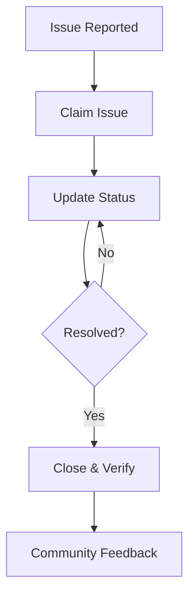

## Overview

Fix-it-Jamaica empowers you to report potholes, broken streetlights, and other infrastructure issues in your community. You track progress, discuss solutions with neighbors, and even contribute to resolutions. The platform connects citizens, local authorities, and volunteers for faster fixes.

<Callout kind="info">
  Access the dashboard at [https://app.fix-it-jamaica.com](https://app.fix-it-jamaica.com) to get started.
</Callout>

## Key Features

Discover the core tools that make community improvements seamless.

<Columns cols={3}>
  <Card title="Report Issues" icon="alert-triangle" href="#report-issue">
    Submit detailed reports with photos and locations in under 2 minutes.
  </Card>
  <Card title="Track Progress" icon="trending-up" href="#monitor-progress">
    View real-time updates and status changes for every report.
  </Card>
  <Card title="Collaborate" icon="users" href="#participate-discussions">
    Join discussions and vote on priorities with your community.
  </Card>
  <Card title="Resolve Issues" icon="check-circle" href="#resolve-issues">
    Tools for authorities and volunteers to claim, update, and close issues.
  </Card>
</Columns>

## Report an Issue

Follow these steps to submit a new infrastructure problem.

<Steps>
  <Step title="Sign In" icon="log-in">
    Create an account or log in at [https://app.fix-it-jamaica.com/login](https://app.fix-it-jamaica.com/login).
  </Step>
  <Step title="Select Category" icon="list">
    Choose from categories like `Pothole`, `Streetlight`, or `Drainage`.
  </Step>
  <Step title="Add Details" icon="map-pin">
    Pin your location on the map, upload photos, and describe the issue.

````javascript
// Example location data you provide
const issueData = {
  title: "Pothole on Main Street",
  category: "roads",
  location: { lat: 18.1096, lng: -77.2975 },
  description: "Large pothole causing traffic hazards.",
  photos: ["photo1.jpg", "photo2.jpg"]
};
````
  </Step>
  <Step title="Submit" icon="send">
    Review and post your report—it appears instantly on the community map.
  </Step>
</Steps>

## Monitor Progress

Stay informed on your reports and others nearby using these views.

<Tabs>
  <Tab title="My Reports" icon="user">
    Filter by your submissions to see status updates like `Reported`, `In Progress`, `Resolved`.

    ```javascript
    // Fetch your reports via API
    const myReports = await fetch('https://api.fix-it-jamaica.com/reports?userId=YOUR_USER_ID', {
      headers: { Authorization: `Bearer ${YOUR_TOKEN}` }
    }).then(res => res.json());
    ```
  </Tab>
  <Tab title="Nearby Issues" icon="map">
    View issues within 5km using the interactive map.

    <Image
      src="https://example.com/map-screenshot.png"
      alt="Interactive map showing nearby infrastructure issues"
      width="800"
      height="500"
    />
  </Tab>
  <Tab title="Status Feed" icon="rss">
    Subscribe to updates via email or push notifications for selected issues.
  </Tab>
</Tabs>

## Participate in Community Discussions

Engage with others to prioritize and brainstorm solutions.

<ExpandableGroup>
  <Expandable title="How to join a discussion" default-open="true">
    Each report has a comment thread. Reply with suggestions, vote on ideas, or tag local authorities using `@parish-council`.
  </Expandable>
  <Expandable title="Voting and upvoting">
    Upvote urgent issues to boost visibility. Top-voted reports get faster attention.
  </Expandable>
  <Expandable title="Share updates">
    Volunteers post progress photos and ETAs directly in the thread.
  </Expandable>
</ExpandableGroup>

## Resolve and Close Issues

Authorities and verified volunteers use these tools to take action.



<Callout kind="tip">
  Always upload before/after photos when closing issues to build trust.
</Callout>

For programmatic updates, use the API:

<CodeGroup tabs="JavaScript,cURL">
  ```javascript
  // Update issue status
  await fetch('https://api.fix-it-jamaica.com/reports/123/status', {
    method: 'PATCH',
    headers: {
      'Authorization': `Bearer ${YOUR_ADMIN_TOKEN}`,
      'Content-Type': 'application/json'
    },
    body: JSON.stringify({
      status: 'resolved',
      notes: 'Pothole filled with asphalt.',
      photos: ['after.jpg']
    })
  });
  ```
  ```bash
  curl -X PATCH https://api.fix-it-jamaica.com/reports/123/status \
    -H "Authorization: Bearer YOUR_ADMIN_TOKEN" \
    -H "Content-Type: application/json" \
    -d '{
      "status": "resolved",
      "notes": "Pothole filled with asphalt.",
      "photos": ["after.jpg"]
    }'
  ```
</CodeGroup>

These features work together to turn reports into real improvements. Start reporting today to make a difference in your neighborhood.